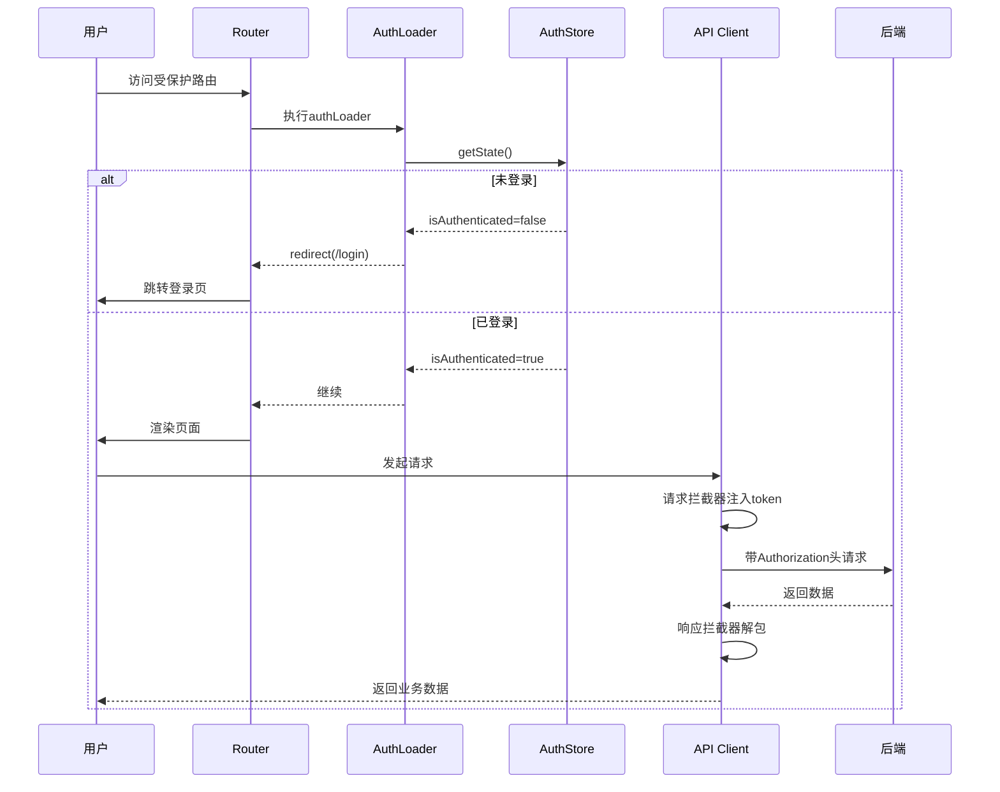
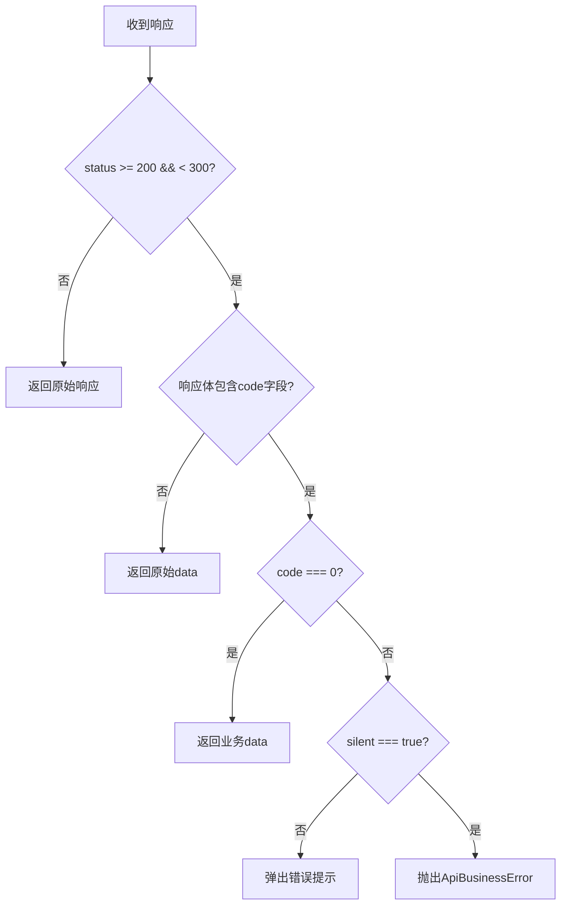

# 图片管理系统 - Code Wiki

## 1. 项目概述

### 1.1 项目定位

企业级图片管理系统，基于 React + TypeScript + Vite 构建，提供图片上传、查看、管理功能，并支持灵活的权限控制和主题定制。

### 1.2 技术栈

| 类别       | 技术选型               | 版本             | 说明                   |
| ---------- | ---------------------- | ---------------- | ---------------------- |
| 核心框架   | React + TypeScript     | React 19, TS 5.9 | 最新特性，完整类型支持 |
| 构建工具   | Vite                   | 8.0              | 极速开发服务器         |
| 路由       | React Router           | 7.13             | 支持数据路由和懒加载   |
| 状态管理   | Zustand                | 5.0              | 轻量高效               |
| 数据缓存   | TanStack Query         | 5.66             | 服务端状态管理         |
| UI组件     | Ant Design             | 6.3              | 企业级组件库           |
| 样式方案   | SCSS + TailwindCSS 4.0 | -                | 灵活的主题定制         |
| HTTP客户端 | Axios                  | 1.7              | 请求拦截、取消         |
| Mock工具   | MSW                    | 2.7              | 本地接口模拟           |

### 1.3 核心功能

- **图片管理**: 上传、列表、预览、重命名、移动、删除、回收站
- **权限系统**: RBAC角色权限、路由级控制、按钮级控制
- **主题系统**: 明暗模式切换、8种预设主题色、CSS变量动态切换
- **性能优化**: 路由懒加载、图片懒加载、React Query缓存、虚拟滚动
- **多标签页**: 类似浏览器的标签页管理，支持keep-alive缓存

---

## 2. 项目架构

### 2.1 目录结构

```
src/
├── apis/                    # API请求层
│   ├── client.ts            # Axios封装与拦截器
│   ├── types.ts             # API响应类型定义
│   ├── auth.ts              # 认证相关API
│   ├── images.ts            # 图片相关API
│   └── user.ts              # 用户相关API
├── components/              # 公共组件
│   ├── layout/              # 布局组件
│   │   ├── RootLayout/      # 根布局
│   │   ├── AdminLayout/     # 后台布局
│   │   └── CLayout/         # 通用布局
│   ├── TabBar/              # 多标签页组件
│   ├── ThemeSwitcher/       # 主题切换器
│   ├── NavigationProgress/  # 导航进度条
│   ├── RouteBreadcrumb/     # 面包屑组件
│   ├── RouteErrorBoundary/  # 错误边界
│   ├── AnimatedOutlet/      # 路由动画容器
│   └── SuspenseFallback/    # 懒加载占位
├── stores/                  # Zustand状态管理
│   ├── authStore.ts         # 认证状态
│   ├── themeStore.ts        # 主题状态
│   └── tabStore.ts          # 标签页状态
├── router/                  # 路由配置
│   ├── index.tsx            # 路由创建入口
│   ├── routeDefinitions.tsx # 路由定义数据源
│   ├── routes/index.tsx     # 路由合并与权限过滤
│   ├── types.ts             # 路由类型定义
│   ├── guards/              # 路由守卫
│   ├── hooks/               # 路由相关Hooks
│   └── utils/               # 路由工具函数
├── pages/                   # 页面组件
│   ├── home/                # 仪表盘首页
│   ├── images/              # 图片管理模块
│   ├── login/               # 登录页
│   ├── profile/             # 个人中心
│   ├── setting/             # 系统设置
│   └── ...
├── hooks/                   # 自定义Hooks
│   ├── useThemeSync.ts      # 主题同步到CSS变量
│   └── useAntdTheme.ts      # Ant Design主题适配
├── lib/                     # 库配置
│   └── queryClient.ts       # TanStack Query配置
├── mocks/                   # MSW模拟数据
│   ├── browser.ts           # Mock服务启动
│   ├── index.ts             # Mock导出
│   └── handlers/            # 请求处理器
├── constants/               # 常量定义
│   └── theme/               # 主题相关常量
└── styles/                  # 全局样式
    ├── minix.scss           # SCSS混合宏
    └── view-transitions.css # 路由过渡动画
```

### 2.2 模块职责

| 模块           | 职责描述                             |
| -------------- | ------------------------------------ |
| **apis**       | 封装HTTP请求，统一响应处理，错误拦截 |
| **components** | 可复用UI组件，包含布局、通用组件     |
| **stores**     | 全局状态管理（认证、主题、标签页）   |
| **router**     | 路由配置、权限守卫、路由工具         |
| **pages**      | 页面级组件，业务逻辑承载             |
| **hooks**      | 自定义React Hooks，封装可复用逻辑    |
| **lib**        | 第三方库初始化配置                   |
| **mocks**      | 开发环境Mock数据                     |
| **constants**  | 常量定义（主题色、背景风格等）       |

### 2.3 核心流程图



---

## 3. 核心模块详解

### 3.1 API层 (apis/)

#### 3.1.1 客户端封装 - client.ts

**核心功能**: Axios配置、请求/响应拦截器、统一错误处理

**关键类与函数**:

| 名称                      | 类型     | 说明                                             |
| ------------------------- | -------- | ------------------------------------------------ |
| `ApiBusinessError`        | class    | 业务错误类，包含code和message                    |
| `apiClient`               | object   | 封装后的API客户端，支持get/post/put/patch/delete |
| `parseBearerToken`        | function | 从Authorization头解析token                       |
| `readAuthorizationHeader` | function | 兼容大小写读取响应头                             |

**请求配置扩展**:

| 参数          | 类型    | 默认值 | 说明                          |
| ------------- | ------- | ------ | ----------------------------- |
| `skipAuth`    | boolean | false  | 为true时不附加Authorization头 |
| `silent`      | boolean | false  | 为true时业务错误不弹出message |
| `withHeaders` | boolean | false  | 为true时返回{data, headers}   |

**响应拦截器流程**:



#### 3.1.2 类型定义 - types.ts

```typescript
// 后端统一响应体
export interface ApiResponse<T = unknown> {
  code: number; // 0表示成功，非0表示业务错误
  data: T; // 业务数据
  message: string; // 提示信息
}

export type Role = 'admin' | 'user' | 'guest';

export interface AuthUser {
  id: string;
  name: string;
  roles: Role[];
  permissions: string[];
}
```

#### 3.1.3 认证API - auth.ts

| 函数    | 功能     | 参数                     | 返回值            |
| ------- | -------- | ------------------------ | ----------------- |
| `login` | 用户登录 | `{ username, password }` | `{ token, user }` |

**登录流程**:

1. 调用 `/auth/login`，设置 `skipAuth: true` 和 `withHeaders: true`
2. 从响应头的 `Authorization: Bearer <token>` 解析token
3. 从响应体获取用户信息

#### 3.1.4 图片API - images.ts

| 函数           | 功能         | 参数                 | 返回值             |
| -------------- | ------------ | -------------------- | ------------------ |
| `getImageList` | 获取图片列表 | `{ page, pageSize }` | `{ items, total }` |

---

### 3.2 状态管理 (stores/)

#### 3.2.1 认证状态 - authStore.ts

**状态结构**:

| 字段              | 类型           | 说明             |
| ----------------- | -------------- | ---------------- |
| `isAuthenticated` | boolean        | 是否已登录       |
| `token`           | string \| null | 用户token        |
| `roles`           | Role[]         | 用户角色列表     |
| `permissions`     | string[]       | 用户权限标识列表 |

**方法**:

| 方法         | 功能         | 参数                          |
| ------------ | ------------ | ----------------------------- |
| `login`      | 登录         | `token, roles?, permissions?` |
| `logout`     | 登出         | 无                            |
| `hasRole`    | 检查单个角色 | `role`                        |
| `hasAnyRole` | 检查任一角色 | `roles[]`                     |
| `hasAnyAuth` | 检查任一权限 | `auth[]`                      |

**持久化**: 使用 `zustand/middleware/persist`，存储键为 `auth-storage`

#### 3.2.2 主题状态 - themeStore.ts

**状态结构**:

| 字段                | 类型              | 说明       |
| ------------------- | ----------------- | ---------- |
| `themeColorId`      | ThemeColorId      | 主题色ID   |
| `backgroundStyleId` | BackgroundStyleId | 背景风格ID |

**方法**:

| 方法                   | 功能         |
| ---------------------- | ------------ |
| `setThemeColorId`      | 设置主题色   |
| `setBackgroundStyleId` | 设置背景风格 |
| `reset`                | 重置为默认值 |

#### 3.2.3 标签页状态 - tabStore.ts

**TabItem接口**:

```typescript
export interface TabItem {
  key: string; // 唯一标识
  path: string; // 路由路径
  title: string; // 显示标题
  closable: boolean; // 是否可关闭
}
```

**方法**:

| 方法           | 功能                     |
| -------------- | ------------------------ |
| `addTab`       | 添加标签页               |
| `removeTab`    | 移除标签页               |
| `setActiveKey` | 设置激活标签             |
| `closeOthers`  | 关闭其他标签             |
| `closeLeft`    | 关闭左侧标签             |
| `closeRight`   | 关闭右侧标签             |
| `closeAll`     | 关闭所有标签（保留首页） |

---

### 3.3 路由系统 (router/)

#### 3.3.1 路由定义 - routeDefinitions.tsx

**RouteDefinition接口**:

| 字段               | 类型              | 说明           |
| ------------------ | ----------------- | -------------- |
| `path`             | string            | 路由路径       |
| `index`            | boolean           | 是否为索引路由 |
| `handle`           | RouteHandle       | 路由元信息     |
| `component`        | string            | 懒加载组件路径 |
| `element`          | ReactNode         | 直接引用的组件 |
| `loader`           | function          | 路由级loader   |
| `shouldRevalidate` | function          | 重新验证策略   |
| `children`         | RouteDefinition[] | 子路由         |

**RouteHandle元信息**:

| 字段             | 类型               | 说明           |
| ---------------- | ------------------ | -------------- |
| `title`          | string             | 页面标题       |
| `menu`           | RouteMenuMeta      | 菜单配置       |
| `breadcrumb`     | string             | 面包屑文案     |
| `keepAlive`      | boolean            | 是否缓存页面   |
| `auth`           | string[]           | 所需权限       |
| `roles`          | string[]           | 所需角色       |
| `animation`      | RouteAnimationMeta | 动画配置       |
| `breadcrumbHide` | boolean            | 是否隐藏面包屑 |

#### 3.3.2 路由守卫 - guards/authLoader.ts

**authLoader**: 受保护路由的鉴权loader

- 检查 `isAuthenticated`
- 未登录时重定向到 `/login?from=<当前路径>`

**loginRedirectLoader**: 登录页loader

- 已登录时重定向到之前的页面或首页

#### 3.3.3 路由权限 - utils/routeAccess.ts

```typescript
// 检查用户是否可访问路由
export function canAccessRoute(def: RouteDefinition): boolean {
  const { hasAnyRole, hasAnyAuth } = useAuthStore.getState();
  const roles = def.handle?.roles;
  const auth = def.handle?.auth;

  const rolesPass = !roles || roles.length === 0 || hasAnyRole(roles);
  const authPass = !auth || auth.length === 0 || hasAnyAuth(auth);

  return rolesPass && authPass;
}
```

#### 3.3.4 路由hooks

| Hook                        | 功能               |
| --------------------------- | ------------------ |
| `useCurrentRouteMeta`       | 获取当前路由元信息 |
| `useNavigateWithTransition` | 带动画的导航       |
| `useNavigationProgress`     | 导航进度状态       |
| `useRouteAnimation`         | 路由动画配置       |
| `useRouteTitle`             | 设置页面标题       |
| `useScrollToTop`            | 页面滚动到顶部     |

---

### 3.4 主题系统

#### 3.4.1 主题色常量 - constants/theme/themeColors.ts

**8种预设主题色**:

| ID              | 名称 | 色值    |
| --------------- | ---- | ------- |
| `lightGreen`    | 淡绿 | #7DB87B |
| `lightBlue`     | 淡蓝 | #6BA3D0 |
| `lightLavender` | 淡紫 | #A698C9 |
| `lightPink`     | 淡粉 | #E8A4B8 |
| `lightOrange`   | 淡橙 | #E8B87C |
| `lightCyan`     | 淡青 | #5EC4D6 |
| `softGray`      | 淡灰 | #8B9BA3 |
| `lightRose`     | 淡玫 | #D48BA8 |

**CSS变量输出**:

| 变量                 | 用途                   |
| -------------------- | ---------------------- |
| `--theme-color`      | 主题色（按钮、链接等） |
| `--bg-base`          | 基础背景色             |
| `--text-primary`     | 主要文字色             |
| `--text-secondary`   | 次要文字色             |
| `--text-disabled`    | 禁用态文字色           |
| `--text-placeholder` | 占位符文字色           |

#### 3.4.2 主题同步Hook - hooks/useThemeSync.ts

**功能**: 将themeStore中的主题色和背景风格同步到CSS变量

```typescript
export function useThemeSync() {
  const { themeColorId, backgroundStyleId } = useThemeStore();

  useEffect(() => {
    const root = document.documentElement;
    const bgStyle = getBackgroundStyle(backgroundStyleId);

    root.style.setProperty('--theme-color', getThemeColorValue(themeColorId));
    root.style.setProperty(BACKGROUND_CSS_VARS.bg, bgStyle.bg);
    root.style.setProperty(BACKGROUND_CSS_VARS.textPrimary, bgStyle.textPrimary);
    // ... 其他变量
  }, [themeColorId, backgroundStyleId]);
}
```

---

### 3.5 布局组件

#### 3.5.1 RootLayout

**职责**: 根布局，提供全局上下文

```typescript
// 根路由loader：确保每次导航都有loading状态
const rootLoader = async () => {
  await new Promise((r) => setTimeout(r, 80));
  return null;
};
```

#### 3.5.2 AdminLayout

**职责**: 后台管理布局，包含：

- 侧边栏菜单
- 顶部导航栏（Logo、主题切换、用户信息）
- 多标签页栏（TabBar）
- 主内容区

---

## 4. 关键依赖与版本

### 4.1 核心依赖

| 依赖                  | 版本    | 用途       |
| --------------------- | ------- | ---------- |
| react                 | ^19.2.0 | UI框架     |
| react-dom             | ^19.2.0 | DOM渲染    |
| react-router-dom      | ^7.13.1 | 路由管理   |
| zustand               | ^5.0.11 | 状态管理   |
| @tanstack/react-query | ^5.66.0 | 数据缓存   |
| antd                  | ^6.3.1  | UI组件库   |
| axios                 | ^1.7.9  | HTTP客户端 |
| classnames            | ^2.5.1  | 条件类名   |

### 4.2 开发依赖

| 依赖              | 版本    | 用途                 |
| ----------------- | ------- | -------------------- |
| vite              | ^8.0.0  | 构建工具             |
| typescript        | ~5.9.3  | TypeScript支持       |
| sass              | ^1.83.0 | SCSS支持             |
| tailwindcss       | ^4.0.0  | 原子化样式           |
| @tailwindcss/vite | ^4.0.0  | TailwindCSS Vite插件 |
| msw               | ^2.7.3  | Mock服务             |
| eslint            | ^9.39.1 | 代码检查             |
| prettier          | ^3.8.1  | 代码格式化           |
| husky             | ^9.1.7  | Git钩子              |

---

## 5. 项目运行

### 5.1 环境要求

- Node.js >= 20.19.0
- pnpm（强制）

### 5.2 启动命令

```bash
# 安装依赖
pnpm install

# 启动开发服务器（自动打开浏览器）
pnpm dev

# 开发环境会自动启用MSW，本地拦截/api/*接口

# 构建生产版本
pnpm build

# 预览生产构建
pnpm preview

# 代码检查
pnpm lint

# 代码格式化
pnpm format
```

### 5.3 环境变量

复制 `.env.example` 为 `.env`，配置以下变量：

| 变量                | 默认值 | 说明        |
| ------------------- | ------ | ----------- |
| `VITE_API_BASE_URL` | `/api` | API基础路径 |

### 5.4 Mock服务

开发环境自动启用MSW，Mock数据位于 `src/mocks/handlers/`

**Mock响应格式**:

```typescript
{
  code: number,      // 0成功，非0失败
  data: any,         // 业务数据
  message: string    // 提示信息
}
```

---

## 6. 开发规范

### 6.1 命名规范

| 类型     | 规范                   | 示例                     |
| -------- | ---------------------- | ------------------------ |
| 组件文件 | PascalCase.tsx         | `ImageCard.tsx`          |
| 工具文件 | camelCase.ts           | `apiClient.ts`           |
| 样式文件 | kebab-case.module.scss | `image-grid.module.scss` |
| 常量     | UPPER_SNAKE_CASE       | `THEME_COLORS`           |
| 类型接口 | I + PascalCase         | `IApiResponse`           |

### 6.2 Git提交规范

```
<type>(<scope>): <subject>

类型说明：
- feat:     新功能
- fix:      修复bug
- docs:     文档更新
- style:    代码格式调整
- refactor: 代码重构
- test:     测试相关
- chore:    构建过程或辅助工具变动
```

**示例**:

```bash
feat(image): 添加图片批量上传功能
fix(auth): 修复token过期后跳转登录页的问题
```

### 6.3 代码检查

- **ESLint**: 风格指南检查
- **Prettier**: 统一代码格式化
- **Husky + lint-staged**: Git提交前检查

---

## 7. 性能优化策略

### 7.1 路由优化

- **懒加载**: 通过 `React.lazy` + `Suspense` 实现组件按需加载
- **代码分割**: Vite自动进行代码分割

### 7.2 数据缓存

- **React Query**: 默认缓存时间60秒，支持缓存失效策略
- **请求防抖/节流**: 根据业务需求实现

### 7.3 图片优化

- **懒加载**: 图片进入视口后才加载
- **占位符**: 使用低质量图片占位

### 7.4 错误处理

- **错误边界**: `RouteErrorBoundary` 捕获路由级错误
- **网络错误**: Axios拦截器统一处理

---

## 8. 权限控制

### 8.1 权限模型

**RBAC（基于角色的访问控制）**:

- `admin`: 管理员，拥有所有权限
- `user`: 普通用户，部分权限

**权限标识示例**:

- `image:read`: 图片读取权限
- `image:write`: 图片写入权限
- `settings:manage`: 设置管理权限

### 8.2 权限检查

**路由级**: 通过 `handle.roles` 和 `handle.auth` 配置，在路由构建时过滤

**组件级**: 使用 `useAuthStore` 的 `hasRole`/`hasAnyRole`/`hasAnyAuth` 方法

```typescript
const { hasRole, hasAnyAuth } = useAuthStore();

// 检查角色
if (hasRole('admin')) {
  // 管理员可见内容
}

// 检查权限
if (hasAnyAuth(['image:write'])) {
  // 有权限的操作
}
```

---

## 9. 扩展与定制

### 9.1 添加新页面

1. 在 `src/pages/` 创建新目录和组件
2. 在 `src/router/routeDefinitions.tsx` 中添加路由定义
3. 配置 `handle` 元信息（标题、菜单、权限等）

### 9.2 添加新主题色

在 `src/constants/theme/themeColors.ts` 中添加新的主题色配置：

```typescript
{ id: 'newColor', name: '新颜色', value: '#XXXXXX' }
```

### 9.3 添加新API

在 `src/apis/` 中创建新的API文件，使用 `apiClient` 封装：

```typescript
import { apiClient } from './client';

export interface NewApiData {
  // 数据结构
}

export function fetchNewData() {
  return apiClient.get<NewApiData>('/endpoint');
}
```

---

## 10. 常见问题

### 10.1 路由懒加载失败

**问题**: 控制台警告 `未找到组件`

**解决**:

- 确认组件路径正确（支持 `@/` 和 `/src/` 格式）
- 确认文件存在且导出 `default`

### 10.2 权限检查不生效

**问题**: 无权限用户仍能访问路由

**解决**:

- 确认路由配置中 `handle.roles` 或 `handle.auth` 正确设置
- 确认用户已登录且角色/权限已正确存储

### 10.3 主题色不生效

**问题**: 修改主题色后页面无变化

**解决**:

- 确认调用了 `useThemeSync` Hook
- 确认CSS中使用了 `var(--theme-color)` 变量

---

## 附录：配置文件说明

| 文件                   | 用途                              |
| ---------------------- | --------------------------------- |
| `vite.config.ts`       | Vite配置（路径别名、TailwindCSS） |
| `tsconfig.json`        | TypeScript基础配置                |
| `tsconfig.app.json`    | TypeScript应用配置（路径别名）    |
| `.env.example`         | 环境变量示例                      |
| `eslint.config.js`     | ESLint配置                        |
| `prettierrc`           | Prettier配置                      |
| `commitlint.config.js` | Commitlint配置                    |
